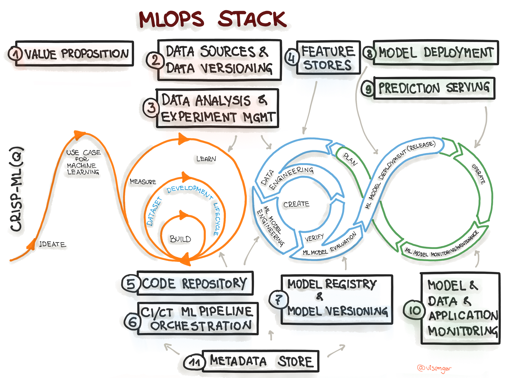

# Greeting, visitors  😄

  

#### My name is <strong>Sirui Tao</strong>.

#### To learn more about me, please  to

 
 
 

 

 

## About Me

 
- I am a rising senior at UCSD, double majoring in Data Science and Probability & Statistics, minoring in Economics.
- I have industry experience designing Data-centric MLOps solutions for Manufacturing applications and automating data analysis & visualization pipelines. 
- My research investigates how to enable ML models with an intuitive human-like 3D physical understanding. I am interested in its downstream application in various domains, including autonomous driving, robotics, design, and architecture.

 

## Career Status

- I am looking for a <strong>full-time or summer intern position starting around April 2023</strong> as <strong>Product Manager/ Data Scientist/ ML Engineer</strong> in <strong>AI/ ML/ Data space</strong>.
- Here is my <a href="resources/info/Sirui_Tao_Resume.pdf">resume</a>,  <a href="resources/info/Sirui_Tao_CV.pdf">CV</a>, and <a href="https://dylantao.github.io/">personal website</a>.

 

## Fun Facts

- 🔭 I’m currently working on Data-centric Vision solution at battery manufacturing team during my summer Tesla internship.
- 🌱 I’m currently learning deep generative model, robotics, and 3D ML.
- 👯 I’m looking to a gym/ coding buddy.
- 🤔 I’m looking for help with getting better with AI research.
- 💬 Ask me about anything data/ AI/ ML or career/ academic, happy to help!
- 📫 How to reach me: DM me on LinkedIn
- 😄 Pronouns: He/ him
- ⚡ Fun fact: If you call my first name, your "Siri" might get activated!

 

## Tech Stack
<h4 align="left">Data Science & Machine Learning</h4>

<h4 align="left">Software Development</h4>

<h4 align="left">Project Management</h4>

<h4 align="left">UI/UX</h4>

 

## Speciality
<h4 align="left">MLOps</h4>

(Cited from <a href="https://ml-ops.org/content/mlops-stack-canvas" target="_blank">MLOps</a>)

## Subject Knowledge
- Data Science & Machine Learning Concepts:  
  - Data Science Life Cycle, Data Visualization, Scalable Analytics, Web Scraping & API, Various Supervised & Unsupervised Models, CNN, RNN, GANs, MLOps, Responsible AI, Recommender System, Data Mining, Database Management
- Software Engineering Concepts:  
  - Algorithms and complexity, Data Structures, Graph Theory, Regex, DevOps, Product Development & Management, User-centric Design, Scalable and Parallel Computing, Cloud Computing, ML/ DL Systems & Tools
- Project Management Concepts:  
  - Stakeholders Analysis, Risk Management, Budgeting, Communication & Documentation, Project Management Life Cycle & Methodologies (Agile), Organizational Structure & Culture, Data-Driven Continuous Improvement Frameworks, Team Development & Management
- Mathematics Concepts: 
  - Probabilistic Reasoning, Combinatorics, Discrete & Continuous Probability, Stochastic Process, Linear Algebra, Statistics Modeling, Hypothesis Testing, Computational Statistics, Descriptive & Inferential statistics, Monte Carlo Simulation, Bootstrap, Random Walk, Parametric & Nonparametric Test
- Finance Concepts:  
  - Micro & Macro Economics, Behavioral Economics, Game Theory, Financial Theory, Portfolio Theory, Financial Statement Analysis, Financial Performance Analysis, Corporate Finance, Option Trading, Decentralized Finance
- Domain-Specific Concepts:
  - IoT, Blockchain Economics, Engine/ Battery-Cell Manufacturing

